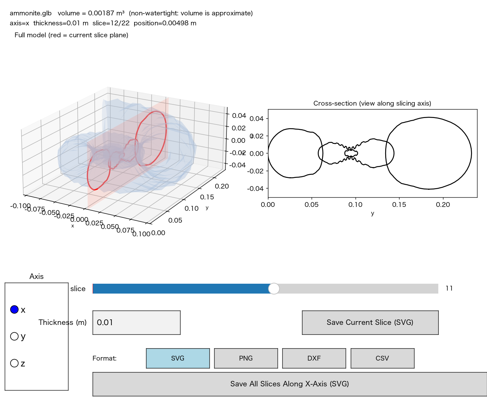

# slice3d

3Dモデル(STL / OBJ / PLY / GLB / GLTF など)を一定間隔でスライスし、断面(輪郭)を SVG / DXF / PNG / CSV として出力するPythonライブラリ・CLIです。[trimesh](https://github.com/mikedh/trimesh) をベースにしています。

アンモナイトの化石モデルをX軸方向にスライスした例:


中心付近の断面(渦巻き状の房室がきれいに現れる):


## インストール

```bash
pip install slice3d

# PNG出力を使う場合(matplotlibが必要)
pip install "slice3d[viz]"
```

開発時はこのリポジトリを editable インストールしてください。

```bash
python -m venv .venv && source .venv/bin/activate
pip install -e ".[dev]"
```

## CLIとして使う

```bash
slice3d model.stl --axis z --thickness 2.0 --outdir slices --format svg
```

| オプション | 説明 | 既定値 |
| --- | --- | --- |
| `--axis {x,y,z}` | スライスする軸 | `z` |
| `--thickness` | スライス間隔(モデル単位) | `1.0` |
| `--start` / `--end` | スライス範囲(省略時はモデルのバウンディングボックス全体) | なし |
| `--outdir` | 出力先ディレクトリ | `./slices` |
| `--format {svg,dxf,png,csv}` | 断面の出力形式 | `svg` |

交差しない位置のスライスは自動的にスキップされます。

## GUIビューア

体積・スライス位置を確認しながら、軸やスライス間隔(thickness)をその場で変更できる専用ウィンドウを開きます。

```bash
pip install "slice3d[gui]"
slice3d-gui model.stl
slice3d-gui model.stl --axis x --thickness 0.01
slice3d-gui model.glb              # glTF/GLBは仕様上メートル単位なので自動で"m"表示
slice3d-gui model.stl --units mm   # STLなど単位不明な形式は明示的に指定
slice3d-gui model.stl --format png # Save系ボタンの初期フォーマット(既定: svg)
```



ウィンドウ内の表示は(体積・軸・数値など)すべて英語で統一しています。

- ウィンドウ上部にモデル名・体積(`mesh.volume`、非watertightなら近似値である旨も表示)
- 左側にモデル全体を半透明の3D表示。現在の切断位置を赤い平面と断面の輪郭線で重ねて表示するので、どこをどの向きで切っているか一目で分かる
- 右側にその断面(切断面を真上から見た2D形状)をリアルタイム表示
- スライダーでスライス位置(index / position)を切り替え
- `Axis` ラジオボタンでスライス軸を切り替え(切り替え時はthicknessが軸の全長に応じてキリの良い値(1/2/5 × 10ⁿ、約30分割相当)に自動再設定される)
- `Thickness` テキストボックスで間隔を指定して Enter → 断面数が再計算される
- 体積・thickness・positionの表示には単位が付く。glTF/GLB(`.glb` / `.gltf`)は仕様上メートル単位と定められているため自動で`m`が付き、STL/OBJ/PLYなど単位情報を持たない形式は既定で単位なし
  - `--units`(例: `mm`, `cm`)で表示単位を明示指定できる。`--units ""` で単位表示を消すことも可能
- `Format` ボタン(SVG/PNG/DXF/CSV)で保存形式を選択。選択中の形式はハイライトされ、Saveボタンのラベルにも反映される
- `Save Current Slice` ボタンで現在表示中の断面を1枚保存
- `Save All Slices Along <軸>-Axis` ボタンで、現在の軸・thickness設定のまま全断面を一括保存(交差しない位置は自動的にスキップ)
- 保存先はどちらも `<モデルと同じディレクトリ>/slices_gui/`

## ライブラリとして使う

```python
import slice3d

# 一括処理: モデルを読み込んでスライスし、ディレクトリへ書き出す
written = slice3d.slice_file("model.stl", "out", axis="z", thickness=1.0, fmt="svg")

# 細かく制御したい場合
mesh = slice3d.load_mesh("model.stl")
for s in slice3d.iter_slices(mesh, axis="z", thickness=1.0):
    if s.is_empty:
        continue
    print(s.index, s.position, len(s.path_2d.discrete))
    slice3d.save_section(s.path_2d, f"out/{s.index:04d}.svg")
```

### API

- `slice3d.load_mesh(path)` — 3Dモデルを読み込み `trimesh.Trimesh` を返す
- `slice3d.compute_heights(mesh, axis, thickness, start=None, end=None)` — スライス位置の配列を計算
- `slice3d.iter_slices(mesh, axis="z", thickness=1.0, start=None, end=None)` — `Slice` を1枚ずつ生成するイテレータ
- `slice3d.slice_mesh(...)` — `iter_slices` の結果をリストで取得
- `slice3d.save_section(path_2d, outpath, fmt=None)` — 1枚の断面を保存(`fmt` 省略時は拡張子から推定)
- `slice3d.print_volume(mesh)` — メッシュの体積を標準出力に表示し、その値を返す
- `slice3d.slice_file(model_path, outdir, axis="z", thickness=1.0, start=None, end=None, fmt="svg")` — 読み込み〜保存までを一括実行

`Slice` は `index`, `axis`, `position`, `path_2d`(`trimesh.path.Path2D | None`), `is_empty` を持つデータクラスです。

## サンプル

```bash
python examples/slice_ammonite.py
```

`examples/ammonite.glb` をX軸方向にスライスし、`examples/output/` にPNGを出力します。

## 開発

```bash
pip install -e ".[dev]"
pytest
```

## ライセンス

MIT License. [LICENSE](LICENSE) を参照してください。
