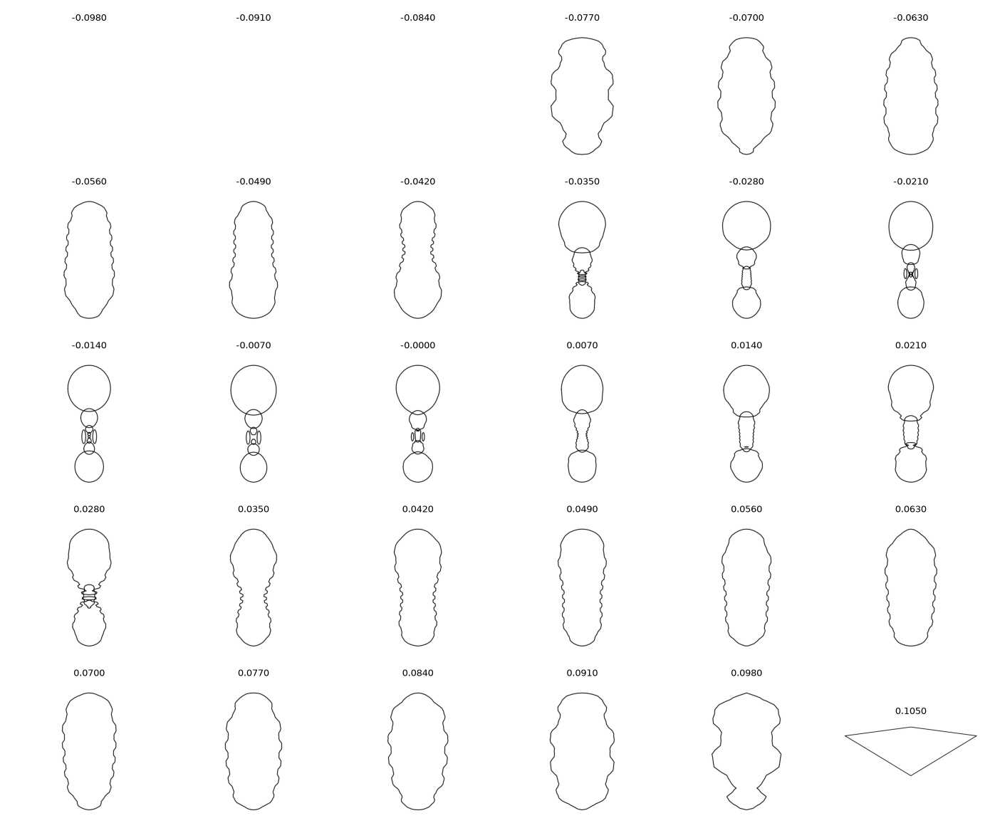
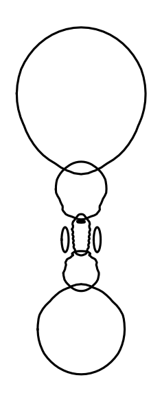

# slice3d

3Dモデル(STL / OBJ / PLY / GLB / GLTF など)を一定間隔でスライスし、断面(輪郭)を SVG / DXF / PNG / CSV として出力するPythonライブラリ・CLIです。[trimesh](https://github.com/mikedh/trimesh) をベースにしています。

アンモナイトの化石モデルをX軸方向にスライスした例:



中心付近の断面(渦巻き状の房室がきれいに現れる):



## インストール

```bash
pip install slice3d

# PNG出力を使う場合(matplotlibが必要)
pip install "slice3d[viz]"
```

開発時はこのリポジトリを editable インストールしてください。

```bash
python -m venv .venv && source .venv/bin/activate
pip install -e ".[dev]"
```

## CLIとして使う

```bash
slice3d model.stl --axis z --pitch 2.0 --outdir slices --format svg
```

| オプション | 説明 | 既定値 |
| --- | --- | --- |
| `--axis {x,y,z}` | スライスする軸 | `z` |
| `--pitch` | スライス間隔(モデル単位) | `1.0` |
| `--start` / `--end` | スライス範囲(省略時はモデルのバウンディングボックス全体) | なし |
| `--outdir` | 出力先ディレクトリ | `./slices` |
| `--format {svg,dxf,png,csv}` | 断面の出力形式 | `svg` |

交差しない位置のスライスは自動的にスキップされます。

## ライブラリとして使う

```python
import slice3d

# 一括処理: モデルを読み込んでスライスし、ディレクトリへ書き出す
written = slice3d.slice_file("model.stl", "out", axis="z", pitch=1.0, fmt="svg")

# 細かく制御したい場合
mesh = slice3d.load_mesh("model.stl")
for s in slice3d.iter_slices(mesh, axis="z", pitch=1.0):
    if s.is_empty:
        continue
    print(s.index, s.position, len(s.path_2d.discrete))
    slice3d.save_section(s.path_2d, f"out/{s.index:04d}.svg")
```

### API

- `slice3d.load_mesh(path)` — 3Dモデルを読み込み `trimesh.Trimesh` を返す
- `slice3d.compute_heights(mesh, axis, pitch, start=None, end=None)` — スライス位置の配列を計算
- `slice3d.iter_slices(mesh, axis="z", pitch=1.0, start=None, end=None)` — `Slice` を1枚ずつ生成するイテレータ
- `slice3d.slice_mesh(...)` — `iter_slices` の結果をリストで取得
- `slice3d.save_section(path_2d, outpath, fmt=None)` — 1枚の断面を保存(`fmt` 省略時は拡張子から推定)
- `slice3d.slice_file(model_path, outdir, axis="z", pitch=1.0, start=None, end=None, fmt="svg")` — 読み込み〜保存までを一括実行

`Slice` は `index`, `axis`, `position`, `path_2d`(`trimesh.path.Path2D | None`), `is_empty` を持つデータクラスです。

## サンプル

```bash
python examples/slice_ammonite.py
```

`examples/ammonite.glb` をX軸方向にスライスし、`examples/output/` にPNGを出力します。

## 開発

```bash
pip install -e ".[dev]"
pytest
```

## ライセンス

MIT License. [LICENSE](LICENSE) を参照してください。
